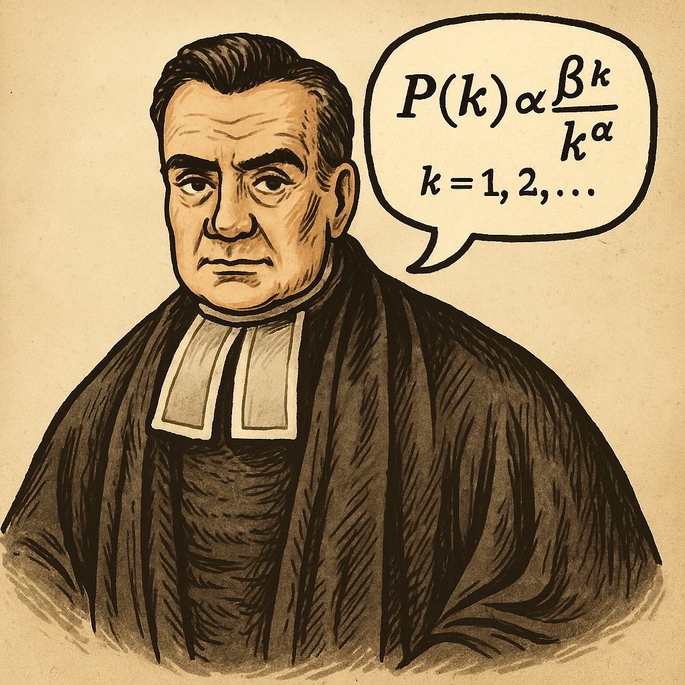

# Bayesian statistics with the Zipf - Polylog distribution

The Zipf-Polylog distribution extends the Zipf distribution by adding an extra parameter.

**Key Reference:**

Valero, J., M. Pérez-Casany, and A. Duarte-López (2022). The
Zipf-Polylog distribution: Modeling human interactions through social
networks. *Physica A: Statistical Mechanics and its Applications.*

**Current research interests:**

* Bayesian-frequentist reconciliation through Bernstein von Mises result.

* Bayesian test for Zipf vs interior of parameter space of Zipf-Polylog. 

* Study the geometry of the model through the Fisher-Rao (infinitessimal) metric, scalar curvature (here, it's just a determinant), etc. We could also compute geodesics that can be helpful for understanding the model better, devising more stable numerical methods, and defining new hypothesis tests.

* Perhaps, build GLMs based on the Zipf-Polylog (it's an exponential family).
    
**Participants:**

* Ariel Duarte-López.
* Marta Pérez-Casany.
* Víctor Peña.
